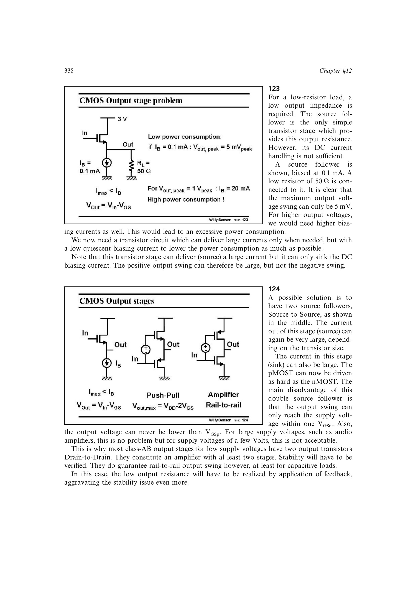

# 从跟随器余量选择低压推挽连接

源跟随器提供低输出电阻，却带来一个 `VGS` 的直流电平移位；通用输出摆幅边界又要求输出尽量靠近电源轨。Class-AB 双向驱动需要上下器件共同参与，把两只输出管改为漏端相接即可去掉两侧 `VGS` 摆幅损失，但必须用反馈恢复输出阻抗并检查多级稳定性。

来源：第 12 章 pp. 338-340，123-126。边权 3：需在电流能力、摆幅、输出阻抗和多级稳定性之间完成非直观的连接方式选择。

## 原书图示

