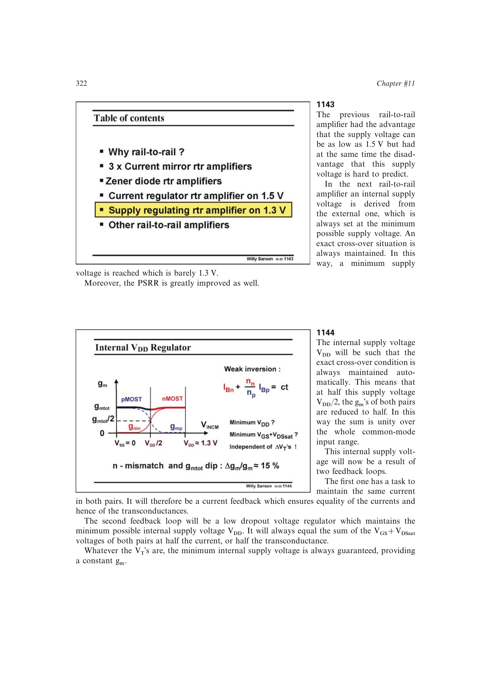

# 用输入支路副本设定最低内部电源

复制偏置提供随器件参数变化的余量样本，低压电流镜可在小压差下复制半电流工作点。将副本所需的 nMOST、pMOST 电压叠加作为反馈基准，再用高环路增益驱动 LDO 调整管，闭环便迫使内部电源跟随恰好维持两侧饱和的最低值。

来源：第 11 章 pp. 322-325，1143-1149。边权 3.5：需把器件余量副本转换为稳压反馈基准，并兼顾低压镜像与环路调节。

## 原书图示

