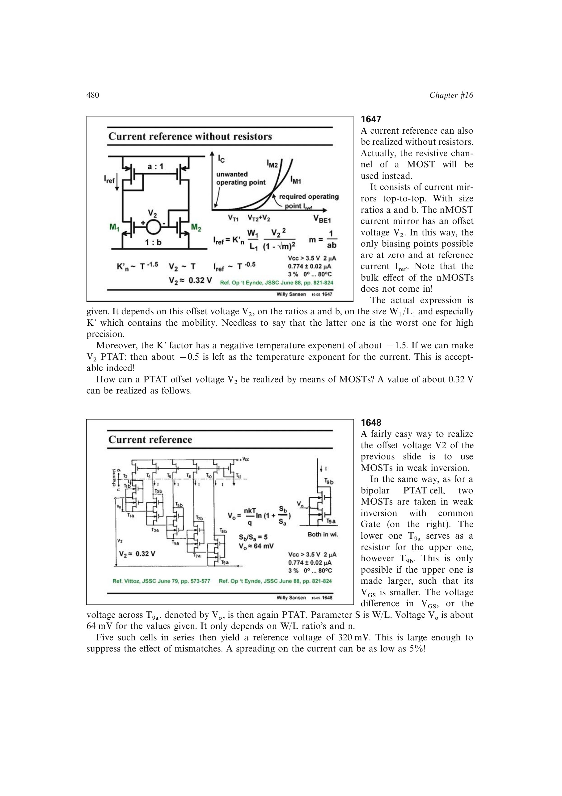

# 用弱反型 PTAT 压差设定 MOST 非零电流点

弱反型尺寸比产生 `Vo=nUT ln(Sb/Sa)`；多个单元串联形成 PTAT `V2`，施加到上下对接的 MOST 镜像环。尺寸比和沟道导电关系共同确定非零交点，而 MOST 参数失配决定散布。

来源：第 16 章 pp. 480-481，1647-1648。边权 4：联合指数 PTAT 构造、镜像非线性工作点和工艺参数温漂完成无电阻电流基准。

## 原书图示

