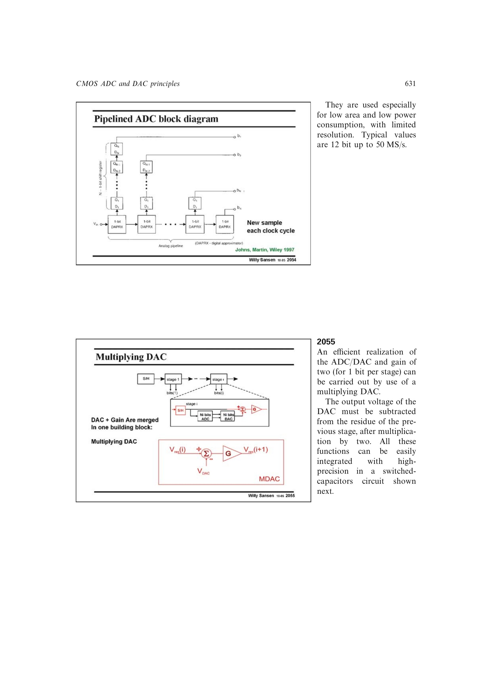

# 由两相电荷守恒得到 MDAC 余量式

相位 1 令 `Cs`、`Cf` 同时采样 `Vres(i)`；相位 2 把 `Cs` 接入反相放大路径并施加 `VDAC`。电荷守恒给出 `Vres(i+1)=Vres(i)+(Cs/Cf)[Vres(i)-VDAC]`，等容时化为 `2Vres(i)-VDAC`。

来源：第 20 章 pp. 631-633，图 20.55-20.58。边权 3.5：需要跨两相列电荷并加入运放闭环精度和动态建立约束。

## 原书图示

