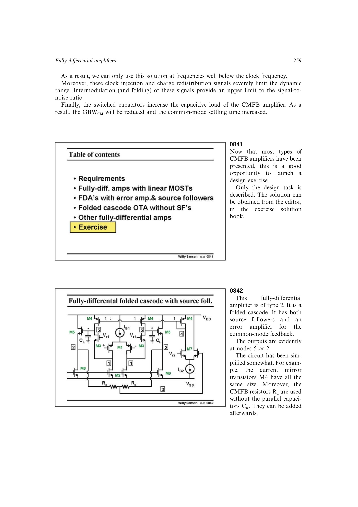

# 按摆幅、速度和极点排序 CMFB 设计

速度-功耗折衷确定目标 GBW，共模负载给出实际电容，拓扑折衷选定结构，MOST 饱和条件确定输出共模参考和摆幅，器件设计次序再把跨导换成电流与尺寸。最后由感知网络定位非主极点并复核其余规格。

来源：第 8 章 pp. 259-261，0841-0846。边权 4：这是把多个相互制约结果组织成可回退的完整设计程序；中间物理量均已独立建模。

## 原书图示

