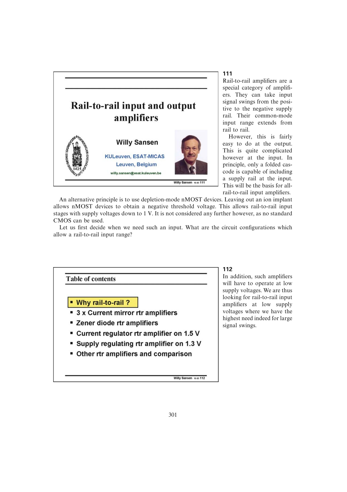

# 从需求、余量、动态到比较组织设计

输入必要性确定目标共模范围，互补输入余量给出可行供电边界，双路径 Miller 补偿保证分段导通时动态环路仍完整，拓扑比较再把 `g_m`、FOM、最低供电、失调与噪声放进同一决策。按此依赖顺序执行，形成可验证且不会遗漏主要失效模式的设计流程。

来源：第 11 章 pp. 301-335，111-1168。边权 4：它把四个已独立建立的设计检查组织成一个有先后依赖的决策方法；方法的价值正来自整体顺序，不能拆成互不相干的建议。

## 原书图示

