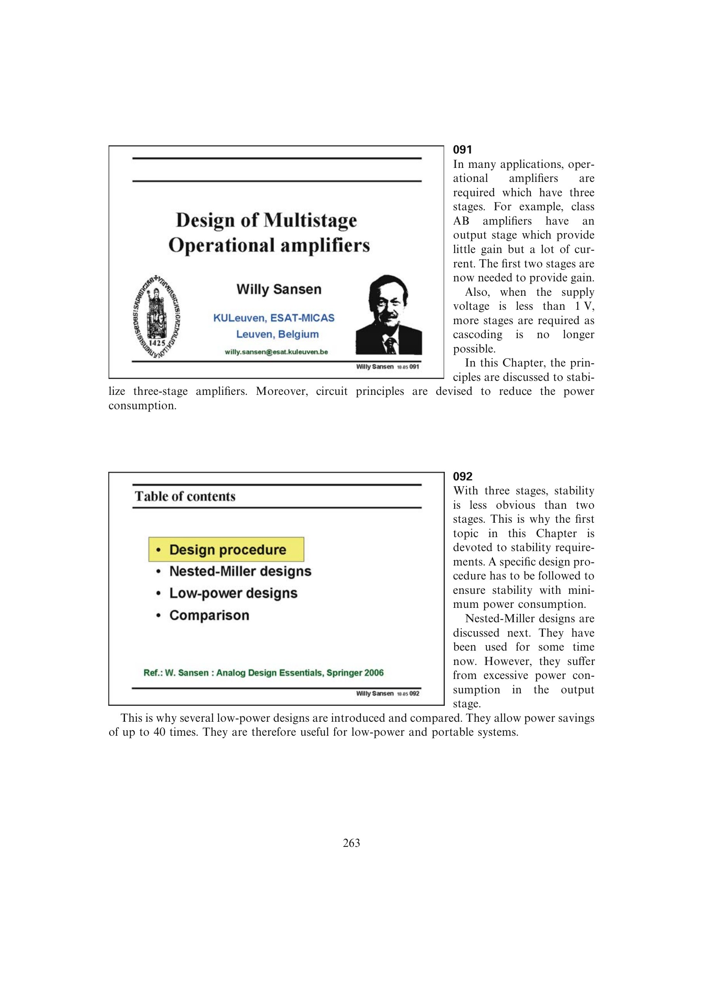

# 按需求、稳定性、补偿与验证排序三级设计

低压增益恢复先决定级数，外层 Miller 极性决定中间级，闭环极点模型决定稳定性目标，寄生和噪声给出电容下限，低功耗比较再决定补偿机制。把所选极零条件换算成跨导后，用小信号及大信号 FOM 复核并迭代。

来源：第 9 章 pp. 263-290，091-0954。边权 4：这是把需求判断、三阶稳定性、补偿构造、跨导尺寸和双 FOM 验证组织成可回退的完整流程；各中间结果均已独立建模。

## 原书图示

