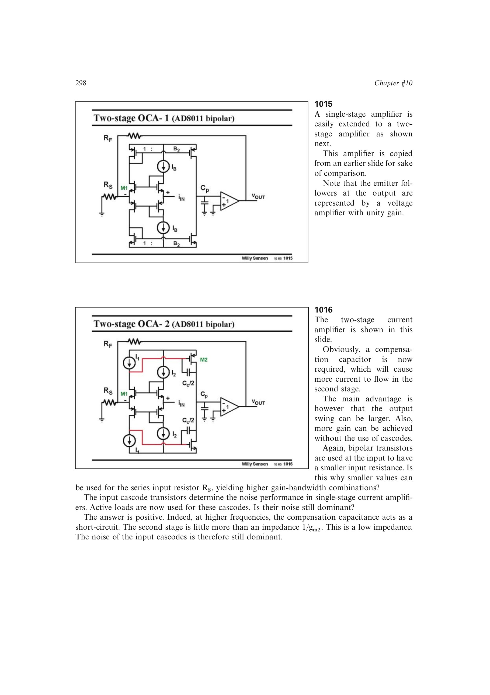

# 用高频补偿短路识别噪声主导级

在噪声相关高频范围把补偿电容视为短路，第二级输入等效为低阻 `1/g_m2`。级联管噪声的驱动-负载判据表明，低阻负载使输入 cascode 噪声不再被抑制；BJT 输入噪声模型再给出其电压和电流噪声分量。

来源：第 10 章 pp. 298-299，1015-1017。边权 3：需把补偿网络的高频极限与 cascode 噪声例外条件结合。

## 原书图示

