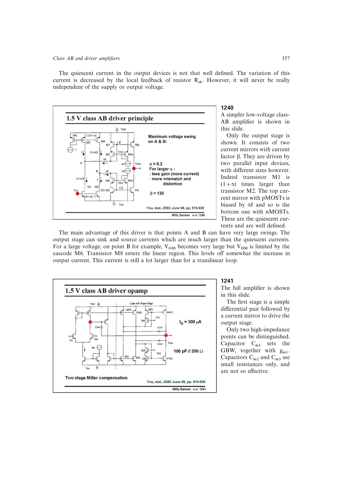

# 用尺寸偏置建立静态电流和扩张镜像

电流镜把输入支路按 `b` 倍送到输出，Class-AB 驱动能力要求大信号电流远高于 `IQ`。把并联输入管尺寸错开 `1+a` 并注入 `aI`，可在零输入时抵消尺寸差并设定静态电流，而输入偏移后由较大器件产生扩张镜像；线性区模型给出大摆幅时的增长上限。

来源：第 12 章 pp. 357-358，1240-1241。边权 3.5：需同时配平尺寸、电流镜倍率、静态抵消和线性区峰值限制。

## 原书图示

