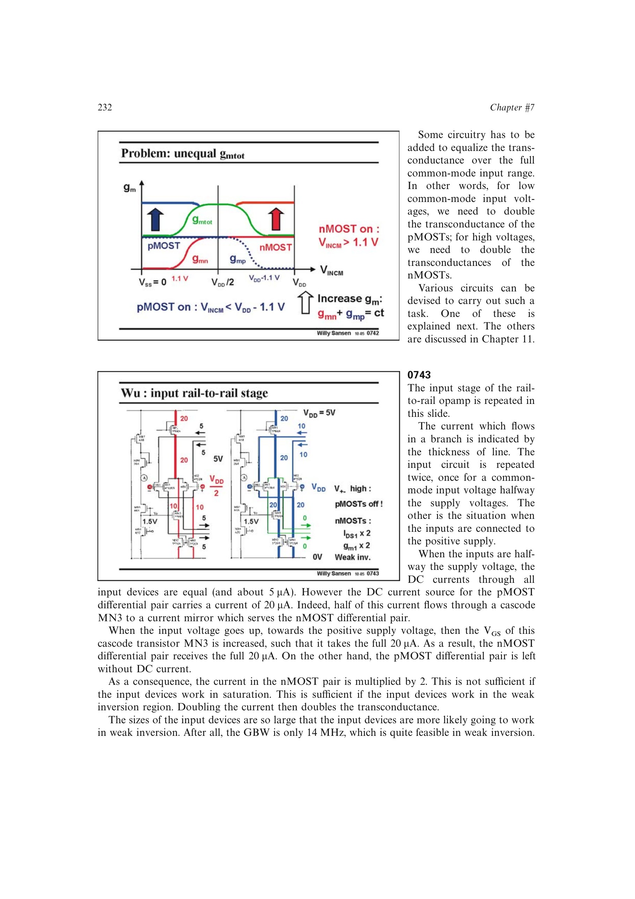

# 用弱反型电流转移保持总跨导

轨到轨 (g_m) 漂移指出需要补足关闭的一半跨导；弱反型模型给出 (g_mpropto I_D)；(g_m/I_D) 说明强反型不具备同样比例。把关闭输入对的电流转给另一对并使电流翻倍，即可在弱反型下近似保持总 (g_m)。

来源：第 7 章 p. 232，0743。边权 3.5：需要根据反型区选择正确的电流-跨导标度，错误地套用平方律会得到不足补偿。

## 原书图示

